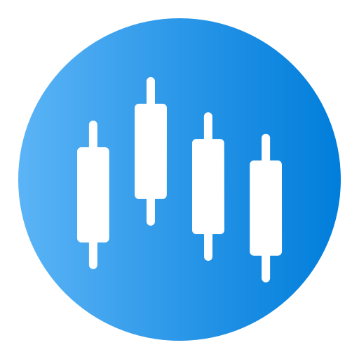
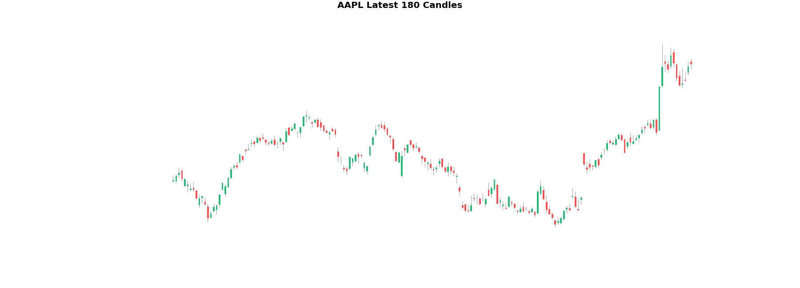
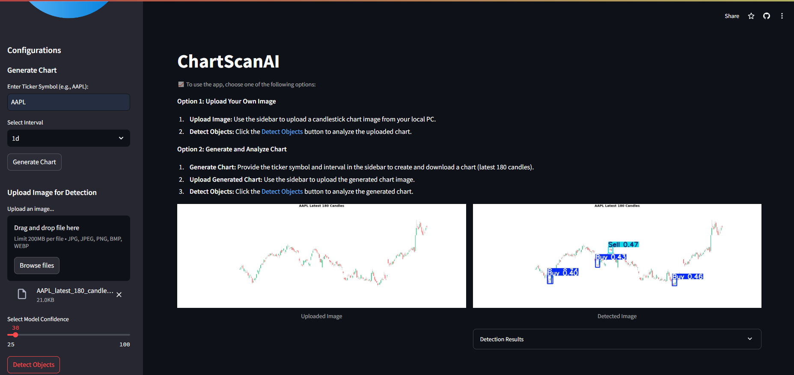

# ChartScanAI


## Overview
ChartScanAI is an advanced application designed for detecting patterns in stock and cryptocurrency charts using deep learning techniques. Inspired by the methodology detailed in the research article "[YOLO Object Recognition Algorithm and “Buy-Sell Decision” Model Over 2D Candlestick Charts](https://ieeexplore.ieee.org/document/9092995)" by Serdar Birogul, Günay Temür, and Utku Kose, this project extends their approach by implementing the model with YOLOv8 and integrating it into a user-friendly Streamlit app. This application aims to automate the process of chart pattern recognition, providing traders and analysts with a powerful tool for making informed decisions.

## About
ChartScanAI leverages the power of YOLOv8, a state-of-the-art object detection algorithm, to identify and classify patterns in financial charts. The model provides outputs in two classes: Buy and Sell, based on candlestick patterns. This application provides a robust solution for traders and analysts to quickly recognize significant chart formations, aiding in more informed decision-making.

## Problem Statement
In the financial market, timely and accurate identification of chart patterns is crucial for making profitable trading decisions. Manual detection is not only time-consuming but also prone to human error. There is a need for an automated system that can analyze charts in real-time, identify patterns with high accuracy, and present the results in an accessible format.

## Data Collection and Data Annotation
The dataset for this project was meticulously curated from various financial sources, ensuring a diverse range of chart patterns. The data collection process involved:
1. **Downloading Charts**: Using the `yfinance` library to download stock and cryptocurrency data.
2. **Plotting Charts**: Generating candlestick plots with `mplfinance`.
3. **Annotation**: Annotating the charts using `Roboflow` to create a comprehensive training dataset.



Using `Roboflow`, various chart patterns were labeled, enabling the YOLOv8 model to learn and detect these patterns with high accuracy. The annotated dataset serves as the foundation for training the model, making it capable of recognizing complex patterns in financial charts.

## ChartScanAI App
The ChartScanAI app, built with Streamlit, offers a seamless interface for users to upload charts, analyze them, and view the detected patterns. Key features include:
- **User-Friendly Interface**: Intuitive design for easy navigation and use.
- **Real-Time Analysis**: Upload a chart and get instant results.
- **High Accuracy**: Powered by the YOLOv8 model, ensuring reliable pattern detection.
- **Versatile**: Supports both stock and cryptocurrency charts.



### How to Use
1. Clone the repository:
    ```bash
    git clone https://github.com/Omar-Karimov/ChartScanAI.git
    cd ChartScanAI
    ```
2. Install the required dependencies:
    ```bash
    pip install -r requirements.txt
    ```
3. Run the Streamlit app:
    ```bash
    streamlit run app.py
    ```
4. Upload your chart and view the detected patterns!

### Online Access
Users can also access the app directly via the following link: [ChartScanAI App](https://chartscanai.streamlit.app)

## Scientific Approach
This project is based on the scientific approach detailed in the research article titled "[YOLO Object Recognition Algorithm and “Buy-Sell Decision” Model Over 2D Candlestick Charts](https://ieeexplore.ieee.org/document/9092995)" by Serdar Birogul, Günay Temür, and Utku Kose. The article demonstrates the effectiveness of using deep learning models for pattern recognition in financial charts. This implementation builds upon this research by utilizing the latest YOLOv8 model and providing an accessible interface for practical use.

## Conclusion
ChartScanAI represents a significant advancement in the automated analysis of financial charts. By leveraging the latest in object detection technology and providing an accessible interface, it aims to empower traders and analysts with a powerful tool for making informed decisions.

## Acknowledgments
Acknowledgments go to the authors of the original research article for their groundbreaking work, which served as the inspiration for this project. Additionally, thanks to the creators of the `yfinance`, `mplfinance`, and `Roboflow` tools for their invaluable resources. 

## Disclaimer
**Important:** ChartScanAI is intended to be used as an informational tool only and should not be considered financial advice. Users are advised to use this tool in conjunction with their own research and professional financial advice.
